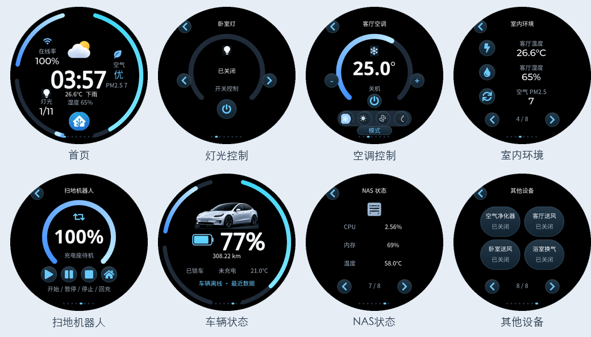

# Dotii Display · NAS Docker 后台 + Home Assistant 触摸屏

让 Dotii 从桌面状态屏升级为家里的智能家居控制屏：**后台常驻 NAS，466×466 圆屏直接查看 Home Assistant 状态、控制灯光与空调，日常使用无需电脑常开。**

本项目基于 [ZeroOne000011/Dotii-Display](https://github.com/ZeroOne000011/Dotii-Display) 扩展，保留上游源码、提交历史和原有 Codex / Bambu / 自定义画面 / Dotii 表情功能，新增 Linux Docker 后台及 **1.3.0-ha 原生触摸固件**。

[下载固件与源码](https://github.com/jh1303366/Dotii-Display-NAS-HA/releases) · [NAS 部署教程](部署说明-极空间Z4.md) · [HA 接入与操作](Home-Assistant使用说明.md) · [验证与限制](Home-Assistant部署与检查报告.md) · [完整界面预览](docs/previews/index.html)



## 新功能一：NAS 上的 Docker 后台

把管理中心放进 NAS，Dotii 通过 Wi-Fi 读取数据并提交触摸操作。只要 NAS、HA 和屏幕在线，电脑上的 Dotii 应用就可以关闭。

- **Linux amd64 / x86_64** 镜像，已在极空间 Z4 部署验证；附 Dockerfile、Compose 和手动构建镜像的 GitHub Actions 工作流。
- 浏览器管理界面，支持独立管理账号、设备访问令牌、模块配置与上传素材。
- `/data` 持久化，容器重建保留设置；健康检查、自动重启和日志轮转方便长期运行。
- NAS 独立读取 Codex 账号额度，首次在官方页面授权；不依赖电脑上的登录目录。当前 NAS 版不采集电脑任务进度。
- 保留 Bambu 局域网状态、控制和相机能力，相机可用性取决于打印机型号与网络。
- NAS 不需要 USB、蓝牙直通或特权模式；首次配网、固件更新在电脑完成。

## 新功能二：Home Assistant 原生触摸固件

专为 **Waveshare ESP32-S3-Touch-AMOLED-1.75 / 466×466 圆屏** 制作。原生 LVGL 界面采用黑色背景、蓝色渐变圆环、大数字及圆形按钮；HA 数据由 NAS 转发，HA 令牌不会下发到屏幕。

| 页面 | 显示与交互 |
| --- | --- |
| 首页 | 时间、温湿度、天气、所选实体在线率、灯光开启数量、PM2.5 |
| 灯光 | 多灯切换、开关；支持亮度的实体可调光 |
| 空调 | 多空调切换、目标温度与模式；按实体能力限制操作 |
| 环境 | 温度、湿度与 PM2.5 |
| 扫地机器人 | 电量与运行状态；按能力开放启动、暂停、停止、回充 |
| 车辆 | 电量、续航、锁车、充电、车内温度与状态，只读 |
| NAS | CPU、内存与温度，只读 |
| 其他设备 | 开关与风扇；支持调速的风扇可调整百分比 |

管理页可发现、选择、重命名和排序最多 **32 个 HA 实体**。支持 `sensor`、`binary_sensor`、`light`、`switch`、`fan`、`climate`、`weather`、`vacuum`。未接入的数据不会凭空显示，断线、过期或实体不可用时禁止控制。

车辆、NAS 及独立扫地机电量的专用角色目前使用示例实体 ID 映射；其他家庭需要按 [HA 使用说明](Home-Assistant使用说明.md) 调整映射。窗帘、场景和任意 HA 服务调用尚未实现。天气图形是装饰素材，天气文字来自 HA。

## 从这里开始

需要：兼容圆屏、2.4 GHz Wi-Fi、可运行 Docker 的 amd64 NAS，以及已有的 Home Assistant。此项目连接现有 HA，不包含 HA 服务器本身。

```sh
git clone https://github.com/jh1303366/Dotii-Display-NAS-HA.git
cd Dotii-Display-NAS-HA
cp .env.example .env
```

编辑 `.env`：将 `DOTII_PUBLIC_URL` 改为屏幕可访问的 NAS 地址，设置至少 12 位的独立管理密码，替换设备令牌。然后在 NAS 或可用的 Docker 环境执行：

```sh
docker compose up -d --build
```

打开 `http://NAS地址:8787`，登录管理页，在 Home Assistant 栏填写 HA 地址和长期访问令牌，选择设备。首次使用时还需刷入固件并通过电脑蓝牙将 Wi-Fi、NAS 地址及设备令牌写入 Dotii。详细步骤见 [NAS 部署教程](部署说明-极空间Z4.md)。没有电脑 Docker，也可在自己的 Fork 中通过 Actions 构建 TAR 后导入 NAS。

**已有 Dotii 固件的设备**可用发布包中的 Mac 更新助手，只写应用分区，保留 Wi-Fi 与 NAS 配置。全新空白开发板需先安装完整基础固件；单独的 `state_display.bin` 不是完整出厂烧录包。

## 下载、预览与验证

- [Releases](https://github.com/jh1303366/Dotii-Display-NAS-HA/releases)：HA 固件、Mac 更新工具、完整源码和界面预览。
- [预览目录](docs/previews)：52 张由实际 LVGL 固件代码渲染的界面图片，包含 HA 与原有系统页面。
- 后端 158 项回归测试通过，其中 22 项 HA 专项检查；ESP-IDF v6.0.2 编译通过，NAS 容器及重启持久化已验证。
- **目前为预发布版本**：尚未完成实体屏幕刷入、触摸、唤醒和断网恢复验收。电脑渲染用于查看布局，不能代替实机效果验证。ARM64 NAS 尚未验证。

公开源码、固件和发布包不包含个人密码、HA 令牌、Codex 授权文件或运行配置。自己的 `.env` 与 `/data` 备份应私下保存。HTTP 管理入口适用于可信家庭局域网；不要直接转发到公网。

## 开发与反馈

[通用开发指南](开发指南.md) · [Windows 开发指南](docs/development/windows.md) · [macOS 开发指南](docs/development/macos.md)

欢迎通过 [Issues](https://github.com/jh1303366/Dotii-Display-NAS-HA/issues) 反馈问题，附上 NAS 架构、固件版本、操作步骤与脱敏日志。提供新设备适配时，说明 HA 实体类型、属性和支持的操作，避免提交令牌或真实授权文件。

感谢上游作者提供 Dotii 硬件、原生界面、桌面管理中心与基础协议。原项目及桌面安装包见 [Dotii-Display](https://github.com/ZeroOne000011/Dotii-Display)，外壳与装配资料见其 README。上游许可、依赖及素材的使用条件请分别核对，本扩展不另行承诺统一许可。
